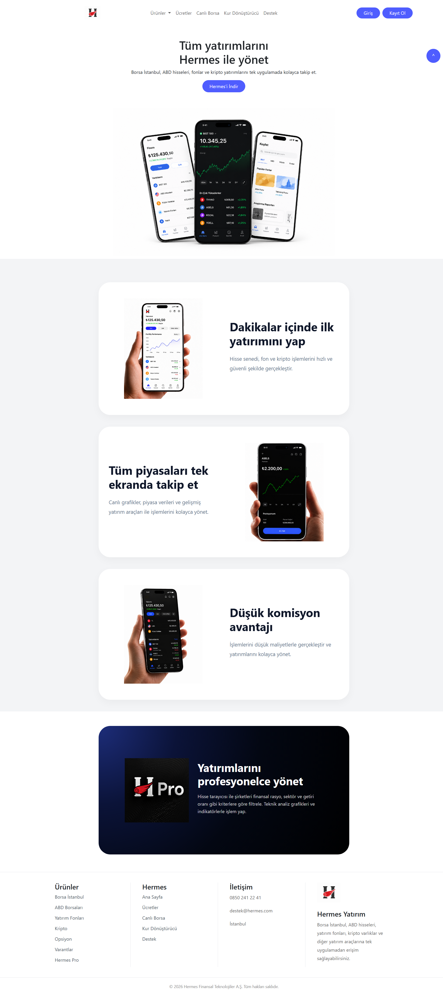
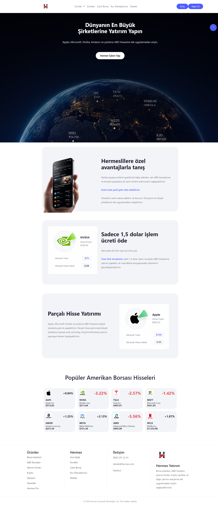
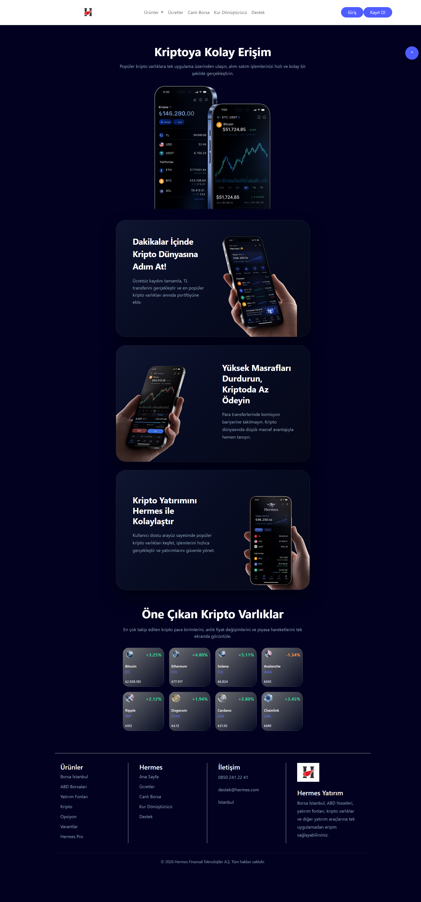
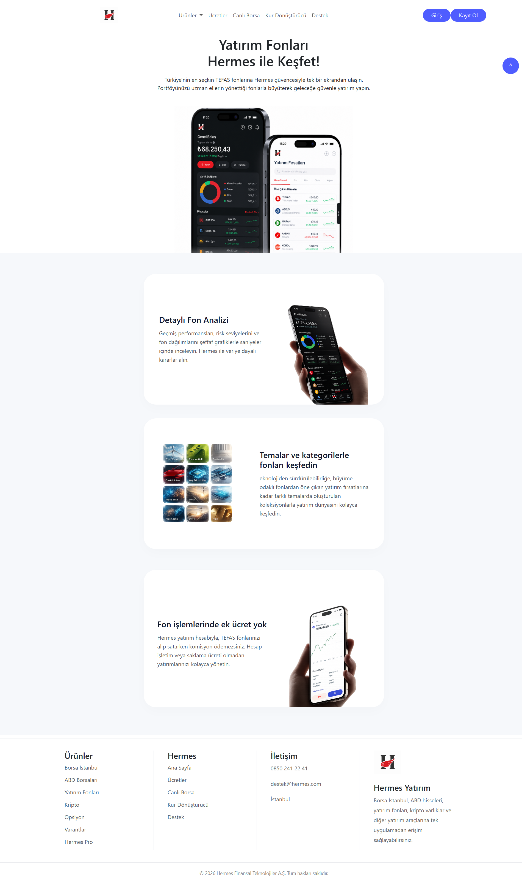
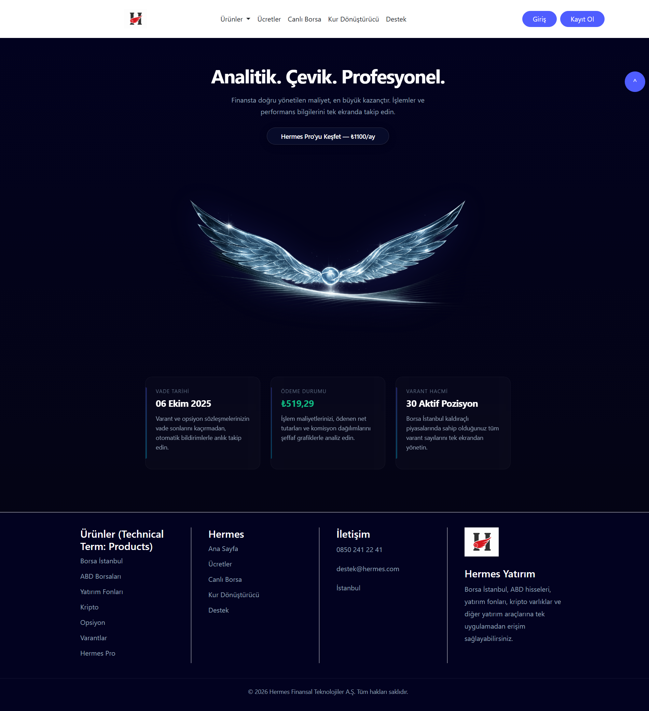

# 🚀 Hermes Investment Website

A modern and responsive investment platform interface developed with **HTML5, CSS3, Bootstrap 5 and JavaScript**.

---

## 📌 About the Project

Hermes Investment Website is a front-end investment platform prototype that simulates a modern financial investment application.

The project includes investment-related pages such as stock markets, cryptocurrencies, investment funds, a currency converter, authentication pages and premium financial products.

---

## ✨ Features

- Responsive Design
- Modern UI
- US Stock Market
- Cryptocurrency Market
- Investment Funds
- Currency Converter
- Hermes Pro Premium
- Login & Registration

---

## 🛠 Technologies

- HTML5
- CSS3
- Bootstrap 5
- JavaScript

---

## 🌐 Live Demo

**Live Website:**

https://emrahyavuz01.github.io/hermes-investment-website/

...

## 📸 Project Screenshots

### 🏠 Home Page



---

### 📈 US Stock Market



---

### ₿ Cryptocurrency



---

### 💰 Investment Funds



---

### ⭐ Hermes Pro



---

## 📁 Folder Structure

```text
Hermes-Investment-Website
│
├── css
│   ├── style.css
│   └── responsive.css
│
├── images
│   └── screenshots
│
├── js
│
├── index.html
├── borsa-istanbul.html
├── abd-borsalari.html
├── canli-borsa.html
├── yatirim-fonlari.html
├── kripto.html
├── opsiyon.html
├── varantlar.html
├── hermes-pro.html
├── kur-donusturucu.html
├── ucretler.html
├── destek.html
├── giris.html
├── kayit-ol.html
├── urunler.html
│
└── README.md
```

---

## 🚀 Getting Started

Clone the repository:

```bash
git clone https://github.com/EmrahYavuz01/hermes-investment-website.git
```

Open `index.html` in your browser.

---

## 👤 Author

**Emrah Yavuz**

GitHub: https://github.com/EmrahYavuz01
